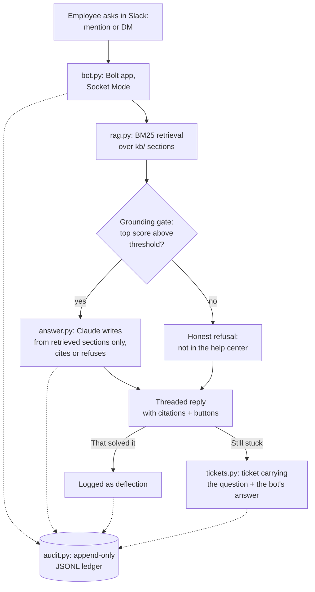

# slack-helpbot-from-scratch

A Slack bot that answers IT questions from the help center, cites its sources, and opens a ticket carrying everything it already tried the moment it cannot help. Built step by step, with working code at every step: you can run the whole pipeline in a terminal with zero API keys, and the retrieval quality gate runs in CI on every push.

This is the code-first sibling of the [IT Help Bot workflow](https://github.com/emiliorobles24/n8n-support-ops) in my n8n collection, and it comes from a conviction I built running support operations in production for years: ticket-category deflection is the highest-leverage work in IT support, but only if you count deflection honestly. A bot that guesses is worse than no bot, because every wrong answer costs a ticket AND the trust that makes people try the bot next time.

## The design in one paragraph

An employee asks a question by mentioning the bot or DMing it. The bot retrieves the most relevant help-center sections, and a grounding gate decides whether the knowledge base actually covers the question. Covered: the answer is written strictly from those sections, with citations, and the employee gets two buttons, "That solved it" and "Still stuck, open a ticket". Not covered: the bot says so plainly and offers the ticket button, no improvising. Tickets carry the question plus what the bot already suggested, so the human agent starts warm. Every step writes one line to an append-only audit ledger.



## Step 1: Prepare the knowledge base

The bot is only as good as what it reads. `kb/` holds the articles as plain markdown, one topic per file, split into `##` sections that each answer one situation ("Locked out after failed attempts", "New phone, old phone already wiped"). Sections are the retrieval unit AND the citation unit: an answer cites the exact article it came from, so a wrong answer is traceable to a wrong or missing article, which turns bot failures into documentation work. That is the same rule I ran on the human side of support: every escalation becomes documentation.

The sample KB here is six articles I wrote for a fictional company (passwords, VPN, MFA, printers, laptops, guest Wi-Fi). Swap in your real help center by pointing `HELPBOT_KB_DIR` at a folder of markdown exports.

## Step 2: Retrieval before AI

[rag.py](rag.py) implements BM25 with a title boost over those sections, in the standard library, on purpose. Two reasons. First, for a help-center-sized corpus, lexical search is a strong baseline, and a baseline with zero dependencies and zero keys means the pipeline is testable everywhere, including CI. Second, retrieval is where this system actually succeeds or fails, so it deserves its own eval (step 6) before any model gets involved.

The upgrade path when the corpus outgrows keywords: embed the sections, run vector plus BM25 hybrid, rerank. The `Retriever.search()` interface does not change, which is the point of building it behind an interface.

## Step 3: Grounded answers, cite or refuse

[answer.py](answer.py) has one job: never let the bot say something the help center does not say. Three layers enforce that:

- A score gate ahead of the model: if the best retrieval score is below a threshold set from the eval data, the KB does not cover the question and the bot refuses before any model call is made.
- A system prompt that permits ONLY the retrieved sections as source material, requires citations, puts security situations (lost phone, compromised account) on the urgent path first, and gives the model an explicit refusal token to emit when the sections do not answer the question.
- A no-key mode: without an API key the bot returns the best-matching section verbatim with its citation. Less conversational, equally honest, and it keeps the whole repo runnable by anyone.

Model calls go to Claude (`claude-opus-5` by default) with a server-side fallback enabled, so a safety-classifier refusal degrades into an escalation instead of an error.

## Step 4: Put it in Slack

[bot.py](bot.py) is a Bolt app in Socket Mode, meaning an outbound websocket and no public URL, no firewall change. [slack-manifest.yml](slack-manifest.yml) creates the app in one paste and encodes least privilege: the bot can read mentions and its own DMs, and holds no channel-history scope at all, so it cannot read channel conversations even in channels it sits in. That scope choice is governance, not convenience; an org-wide bot that can read everything is a data-boundary incident waiting for a prompt injection. The design consequence is deliberate: anything the escalation needs has to travel with the interaction itself, which is exactly how step 5 works.

Answers land in a thread with the citations line and the two buttons. The buttons are the measurement instrument: "That solved it" is the only thing that counts as a deflection (step 7).

## Step 5: Close the loop with the ticket system

[tickets.py](tickets.py) is the bot's honest exit. "Still stuck" opens a ticket carrying the question and the answer the bot already gave, so nobody repeats themselves to a human. The context travels with the interaction itself: the question rides in the ticket button's value and the answer is the message the button sits on, which is what lets the bot escalate with zero history scopes. By default tickets go to a local outbox file so the flow is testable with no accounts; set the `JIRA_*` variables and the same call creates a Jira issue in your project through the platform REST API (for a JSM customer request that shows in the portal, point the same interface at the servicedeskapi request endpoint instead).

## Step 6: Evaluate before you trust it

[eval.py](eval.py) is a golden set of questions phrased the way employees actually type ("got a new phone and my mfa codes are gone"), each mapped to the article that should answer it, plus out-of-scope questions (expenses, 401k, room booking) that must fall below the grounding gate. Two numbers come out: retrieval hit rate in the top 3 (target 80 percent or better; currently 12/12) and refusal rate on out-of-scope (target all; currently 3/3). [The CI workflow](.github/workflows/eval.yml) runs this on every push with no API keys, so a KB edit or retrieval change that breaks answer quality fails the build instead of failing an employee.

This eval already earned its keep during the build: the first run caught that "wifi" did not match "Wi-Fi" and that the refusal gate was set too low, both fixed before any user would have hit them.

## Step 7: Measure deflection honestly

The number this bot reports is not "questions answered", it is "questions where the employee clicked That solved it and no ticket followed". Everything else is noise or worse. The audit ledger ([audit.py](audit.py)) makes the honest number computable: every asked, answered, not_covered, solved, and ticket_created event is one JSON line with a hashed user ID and the citations used. On top of that ledger you can run the QA pattern from my n8n collection: sample the "solved" threads weekly and audit them for false resolutions, because deflection only counts if the answers were right.

## Step 8: Roll it out like a program, not a launch

Pilot in one team channel for two weeks, read the ledger, fix the KB gaps it exposes (every not_covered event is a missing or unfindable article), then widen. Weekly: deflection rate, top not_covered questions, false-resolution rate from QA sampling. The bot earns each expansion with its numbers.

## Run it

Terminal, no keys, nothing to install:

```
python3 dev_chat.py
python3 eval.py
```

Model answers: `pip install anthropic`, set `ANTHROPIC_API_KEY`, run the same commands.

Slack: create the app from [slack-manifest.yml](slack-manifest.yml), `pip install -r requirements.txt`, copy [.env.example](.env.example) to `.env` and fill the Slack tokens, then `python3 bot.py`.

## Repo layout

```
bot.py                  Slack surface (Bolt, Socket Mode, buttons, transcripts)
rag.py                  BM25 retrieval over kb/ sections
answer.py               grounding gate + cite-or-refuse answering (Claude or extractive)
tickets.py              escalation: mock outbox by default, Jira REST when configured
audit.py                append-only JSONL ledger, hashed user IDs
dev_chat.py             the whole pipeline in a terminal, zero keys
eval.py                 golden-set eval: hit rate + refusal gate (runs in CI)
kb/                     sample help-center articles (six topics)
slack-manifest.yml      one-paste Slack app definition, least-privilege scopes
.github/workflows/      CI: eval on every push
```

## Related projects

[n8n-support-ops](https://github.com/emiliorobles24/n8n-support-ops) (the IT Help Bot workflow this expands, plus the QA auditor and audit ledger patterns) · [okta-as-code](https://github.com/emiliorobles24/okta-as-code) · [endpoints-as-code](https://github.com/emiliorobles24/endpoints-as-code) · [jira-from-scratch](https://github.com/emiliorobles24/jira-from-scratch) (the service desk this bot deflects for) · [mdm-compliance-dashboard](https://github.com/emiliorobles24/mdm-compliance-dashboard)

## Honest scope

The operational patterns here are from my production years running IT support at a 1,000+ person public SaaS company: ticket-category deflection, SLA programs with proactive alerting, documentation as the exit condition of every escalation, and org-wide rollout and governance of ChatGPT Enterprise, Codex, and Claude. This bot itself is a portfolio build: it runs end to end locally against the sample knowledge base (terminal mode, mock tickets, and the eval suite, all verified; the same eval runs in CI on every push), and it has not been deployed to a production Slack workspace. The Slack and Jira integrations follow those platforms' standard APIs and are wired to be swapped in, not claimed as battle-tested.

Built with AI coding agents in the loop; reviewed, tested, and owned by me.
